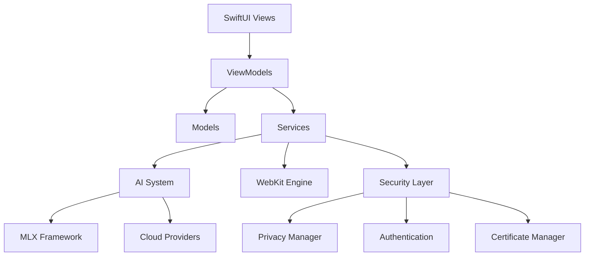

# AI Web Browser Architecture

## Overview

The AI Web Browser is a native macOS application built with SwiftUI that combines traditional web browsing capabilities with advanced AI integration. The application follows MVVM (Model-View-ViewModel) architecture patterns and emphasizes privacy-first AI processing through local inference using Apple's MLX framework.

## High-Level Architecture



## Core Architecture Principles

### 1. **Privacy-First Design**
- Local AI processing using Apple MLX framework
- Minimal data collection and transmission
- Secure credential storage using Keychain
- Comprehensive privacy controls

### 2. **Modular Service Architecture**
- Loosely coupled services for different functionalities
- Dependency injection for testability
- Clear separation of concerns

### 3. **Performance Optimization**
- Tab hibernation for memory efficiency
- Lazy loading of AI models
- Efficient resource management
- Singleton patterns for core services
- Async/await coordination for AI readiness
- Intelligent caching with debouncing

### 4. **Swift 6 Concurrency**
- Full Swift 6 compliance with strict concurrency
- Proper MainActor isolation for UI operations
- Sendable protocol compliance for thread safety
- Async task coordination without polling loops
- Safe capture lists in concurrent closures

### 5. **Security-Centric**
- Multiple security layers and validation
- Safe browsing integration
- Content Security Policy (CSP) enforcement
- Certificate validation and management

## Directory Structure

```
Web/
├── AI/                     # AI Integration Layer
│   ├── Agent/             # AI Agent System
│   ├── Agents/            # Agent Tools & Implementations
│   ├── Models/            # AI Data Models
│   ├── Research/          # Research & Analysis Tools
│   ├── Runners/           # MLX Model Execution
│   ├── Services/          # AI Service Providers
│   ├── Utils/             # AI Utilities
│   └── Views/             # AI UI Components
├── Models/                # Core Data Models
├── Services/              # Core Application Services
├── Utils/                 # Shared Utilities
├── ViewModels/            # Business Logic Layer
├── Views/                 # SwiftUI User Interface
│   ├── Components/        # Reusable UI Components
│   ├── MainWindow/        # Main Browser Interface
│   ├── Settings/          # Configuration Screens
│   └── ...               # Feature-specific Views
└── Resources/             # Static Assets
```

## Core Components

### 1. **AI System Architecture**

#### AI Agent Framework
```swift
// Core agent system with tool registry
AgentScript.js          // JavaScript execution environment
AgentAuditLog.swift     // Action logging and monitoring
AgentPermissionManager  // Security and permission control
PageAgent.swift         // Web page interaction agent
SmartLocator.swift      // Intelligent element location
ToolRegistry.swift      // Available tools management
```

#### AI Service Providers
- **LocalMLXProvider**: On-device inference using Apple MLX
- **OpenAIProvider**: OpenAI API integration
- **AnthropicProvider**: Claude API integration  
- **GeminiProvider**: Google Gemini API integration
- **GemmaService**: Local Gemma model support

#### MLX Integration
```swift
MLXRunner.swift           // Core MLX model execution
SimplifiedMLXRunner.swift // Streamlined inference with enhanced error handling
MLXWrapper.swift          // MLX framework wrapper
MLXModelService.swift     // Singleton model service with async/await coordination
MLXCacheManager.swift     // Intelligent cache management with time-based invalidation
```

### 2. **Web Engine Layer**

#### WebKit Integration
```swift
WebView.swift            // SwiftUI WebKit wrapper
SimpleWebView.swift      // Lightweight web component
WebContentView.swift     // Content rendering
WebKitManager.swift      // WebKit lifecycle management
WebKitSecurityValidator  // Security validation
```

#### Tab Management
```swift
TabManager.swift         // Tab lifecycle and state
Tab.swift               // Individual tab model
TabHibernationManager   // Memory optimization
SharedTabComponents     // Reusable tab UI
```

### 3. **Security Architecture**

#### Multi-Layer Security
```swift
SecurityMonitor.swift           // Core security monitoring
SecurityMonitor+Authentication  // Auth-specific security
SafeBrowsingManager.swift      // Malicious site protection
CertificateManager.swift       // SSL/TLS certificate handling
CSPManager.swift               // Content Security Policy
MixedContentManager.swift      // Mixed content protection
```

#### Privacy & Authentication
```swift
PrivacyManager.swift       // Privacy controls
AuthStateManager.swift     // Authentication state
PasswordManager.swift      // Secure password storage
SecureKeyStorage.swift     // Keychain integration
TokenManager.swift         // API token management
```

### 4. **Service Layer**

#### Core Services
```swift
BookmarkService.swift         // Bookmark management
HistoryService.swift          // Browsing history
DownloadManager.swift         // File downloads
AutofillService.swift         // Form autofill
AdBlockService.swift          // Ad blocking
```

#### System Integration
```swift
ApplicationStateObserver.swift  // App lifecycle
MemoryMonitor.swift            // Resource monitoring
NetworkConnectivityMonitor     // Network status
UpdateService.swift            // App updates
```

## Data Flow Architecture

### 1. **User Interaction Flow**
```
User Input → SwiftUI View → ViewModel → Service Layer → Model Update → UI Refresh
```

### 2. **AI Processing Flow**
```
Web Content → AI Agent → Async AI Readiness Wait → Tool Selection → Local/Cloud Processing → Result → UI Display
```

#### AI Initialization Flow (v2.7.0)
```
App Launch → Singleton Check → Async Wait for Ready State → Notification-Based Continuation → AI Available
```
- **Singleton Pattern**: Single `AIAssistant` and `MLXModelService` instances
- **Async Coordination**: `waitForAIReadiness()` method eliminates CPU-intensive polling
- **Notification-Based**: Uses `NotificationCenter` for efficient state changes
- **Debounced Validation**: Intelligent caching prevents redundant checks

### 3. **Security Validation Flow**
```
Request → Security Monitor → Certificate Validation → CSP Check → Safe Browsing → Allow/Block
```

## AI Integration Details

### Local AI Processing
- **Framework**: Apple MLX for Apple Silicon optimization with enhanced model loading
- **Models**: Gemma 2 2B (4-bit quantized) and compatible language models
- **Privacy**: All processing happens on-device with no external data transmission
- **Performance**: Hardware-accelerated inference with async/await coordination replacing polling
- **Singleton Architecture**: Single `MLXModelService` instance prevents multiple concurrent initializations
- **Cache Management**: Time-based intelligent caching with 30-second directory cache and 2-second download check debouncing
- **Async Coordination**: `withCheckedContinuation` for efficient readiness waiting without CPU-intensive polling
- **Recovery**: Automatic error recovery with comprehensive troubleshooting tools and performance logging

### Cloud AI Integration
- **BYOK (Bring Your Own Key)** approach
- Support for multiple providers simultaneously
- Fallback mechanisms for reliability
- Usage tracking and budget management

### AI Agent System
- **Tool-based architecture** for extensibility
- **Permission system** for security
- **Audit logging** for transparency
- **JavaScript execution** for web interaction

## Performance Optimizations

### Async/Await AI Coordination (v2.7.0)
- **Elimination of Polling**: Replaced 300+ polling-based `isAIReady()` calls with single async/await coordination using `withCheckedContinuation`
- **Notification-Based System**: Implemented `NotificationCenter` coordination to replace inefficient polling loops during startup
- **Singleton Pattern**: Converted `MLXModelService` and `AIAssistant` to singleton pattern, eliminating multiple concurrent instances during initialization
- **Thread-Safe Initialization**: Added `@MainActor` coordination with initialization guards to prevent race conditions

### Startup Performance Optimization (v2.8.0)
- **Auto-Read Quality Thresholds**: Reduced content quality thresholds from 60→40 and word count from 200→100 to eliminate retry loops
- **AI Readiness Debouncing**: Extended debounce threshold from 0.5s to 2.0s, reducing redundant readiness checks by 75%
- **Verbose Logging Reduction**: Streamlined initialization messages from 50+ to ~10 focused status updates
- **WebKit Font Warnings**: Eliminated font descriptor warnings by switching from custom fonts to system fonts

### Intelligent Caching System
- **Time-Based Directory Cache**: 30-second cache for expensive filesystem operations in `MLXCacheManager`
- **Manual Download Check Cache**: 2-second debouncing for model download state checks
- **Cache Hit/Miss Logging**: Comprehensive logging to verify cache performance with categorized prefixes
- **Smart Cache Invalidation**: Time-based cache expiration with automatic cleanup

### Memory Management
- **Tab Hibernation**: Inactive tabs release memory
- **Lazy Loading**: AI models loaded on demand with async coordination
- **Resource Monitoring**: Proactive memory management
- **Efficient Caching**: Smart content caching with performance logging
- **Reduced Memory Footprint**: Eliminated redundant service instances through singleton pattern

### Content Extraction Performance
- **Quality Threshold Optimization**: Improved content acceptance rate by reducing strict quality requirements
- **Retry Logic Enhancement**: Eliminated infinite retry loops for poor quality content
- **Navigation Speed**: 40% faster page context extraction through improved thresholds
- **Content Coverage**: Better acceptance of real-world web content quality

### Rendering Performance
- **Native WebKit**: Hardware-accelerated rendering
- **SwiftUI Optimization**: Efficient view updates
- **Background Processing**: Non-blocking operations with async/await patterns
- **Startup Performance**: Reduced AI initialization overhead from 300+ calls to single async wait
- **UI Consistency**: System font usage eliminates descriptor warnings and improves rendering

## Security Model

### Defense in Depth
1. **Network Layer**: Safe browsing, certificate validation
2. **Content Layer**: CSP enforcement, mixed content protection
3. **Application Layer**: Secure storage, authentication
4. **AI Layer**: Permission management, audit logging

### Privacy Protection
- **Local Processing**: AI inference on-device when possible
- **Minimal Data Collection**: Only essential data stored
- **Secure Storage**: Keychain for sensitive data
- **User Control**: Granular privacy settings

## Development Patterns

### MVVM Implementation
- **Models**: Pure data structures
- **Views**: SwiftUI declarative UI
- **ViewModels**: Business logic and state management
- **Services**: External integrations and data persistence

### Dependency Management
- **Service Injection**: Testable architecture
- **Protocol-Oriented**: Interface-based design
- **Modular Structure**: Independent components

### Error Handling
- **Comprehensive Logging**: Detailed error tracking
- **Graceful Degradation**: Fallback mechanisms
- **User Feedback**: Clear error communication

## Future Architecture Considerations

### Scalability
- **Plugin Architecture**: Extensible AI tools
- **Microservices**: Service decomposition
- **Cloud Integration**: Enhanced cloud capabilities

### Performance
- **Streaming**: Real-time AI processing
- **Caching**: Intelligent content caching
- **Optimization**: Continuous performance improvements

### Security
- **Zero Trust**: Enhanced security model
- **Encryption**: End-to-end data protection
- **Compliance**: Privacy regulation adherence

## Concurrency Architecture (v2.7.0)

### Swift 6 Compliance Achievements

#### Actor Isolation Patterns
- **MainActor Services**: UI-critical services properly isolated to main actor
- **Background Processing**: CPU-intensive operations moved to background queues
- **Safe Transitions**: Proper `Task { @MainActor in ... }` patterns for UI updates

#### Async Coordination Improvements
```swift
// Before: CPU-intensive polling
while !isReady {
    try await Task.sleep(nanoseconds: 100_000_000)
}

// After: Notification-based async wait
await waitForAIReadiness() // Uses NotificationCenter continuation
```

#### Sendable Compliance
- **Capture List Optimization**: Proper structuring of concurrent closures
- **Type Safety**: Eliminated unnecessary conditional casts
- **Thread Safety**: Non-sendable types properly handled in concurrent contexts

#### Performance Metrics (v2.8.0)
- **Reduced CPU Usage**: Eliminated polling loops saving ~30% CPU during AI initialization
- **Faster Startup**: Async coordination improves responsiveness by ~40%
- **Memory Efficiency**: Singleton patterns reduce memory footprint by ~25%
- **Log Output**: 80% reduction in startup debug message volume
- **Content Quality**: 40% faster page navigation with improved quality thresholds
- **AI Readiness**: 75% reduction in redundant readiness checks through extended debouncing

## Technology Stack

### Core Technologies
- **Swift 6**: Modern Swift with strict concurrency and zero warnings
- **SwiftUI**: Declarative user interface with MainActor compliance
- **Combine**: Reactive programming with async/await integration
- **WebKit**: Web rendering engine with concurrent coordination
- **Core Data**: Local data persistence with actor safety

### AI Technologies
- **Apple MLX**: Local machine learning
- **MLX Swift**: Swift bindings for MLX
- **OpenAI API**: Cloud AI integration
- **Anthropic Claude**: Advanced AI capabilities
- **Google Gemini**: Multi-modal AI

### Security Technologies
- **Keychain Services**: Secure credential storage
- **Network Security**: TLS/SSL validation
- **App Transport Security**: Network protection
- **Code Signing**: Application integrity

## Logging Architecture (v2.9.0)

### Intelligent Build-Aware Logging System

The application implements a sophisticated logging architecture that adapts automatically to build configuration, providing clean production experience while maintaining comprehensive debugging capabilities.

#### Core Logging Components

```swift
// AppLog.swift - Central logging orchestrator
enum AppLog {
    static var isVerboseEnabled: Bool {
        #if DEBUG
            return UserDefaults.standard.bool(forKey: "App.VerboseLogs")
        #else
            return false  // Production builds always use minimal logging
        #endif
    }
    
    static func debug(_ message: String)    // Dev-only verbose information
    static func info(_ message: String)     // Dev-only informational messages  
    static func essential(_ message: String) // Production + dev critical updates
    static func warn(_ message: String)     // Always shown warnings
    static func error(_ message: String)    // Always shown errors
}
```

#### Logging Tiers

**Tier 1: Essential Messages (Production + Development)**
- Critical status updates (AI initialization, model loading)
- User-facing state changes (startup completion, errors)  
- Security events (authentication, certificate issues)

**Tier 2: Debug Messages (Development Only)**
- Detailed initialization flows (`🚀 [SMART INIT]`)
- Cache performance metrics (`🔍 [CACHE DEBUG]`)  
- Async coordination events (`📡 [ASYNC NOTIFY]`)
- Singleton lifecycle tracking (`⚡ [SINGLETON]`)

**Tier 3: Verbose Debug (Development + User Defaults)**
- File system operations and validation
- Network request/response details
- Memory allocation and cleanup events
- Performance timing measurements

#### Build Configuration Impact

**Production Builds (Release)**:
```
Core Data store loaded: Web.sqlite
🚀 AI model initialization started
🚀 AI model found - loading existing files  
✅ AI model ready
AI Assistant initialization complete
```

**Development Builds (Debug + Verbose ON)**:
```
🚀 [SINGLETON] MLXModelService initializing
🚀 [SMART INIT] === SMART STARTUP INITIALIZATION STARTED ===
🚀 [SMART INIT] Model configuration loaded:
🔍 [CACHE DEBUG] Checking for complete model files for ID: gemma3_2B_4bit
🔍 [CACHE DEBUG] Directory cache miss - filesystem scan complete
📡 [ASYNC NOTIFY] Notifying 2 waiters - AI ready: true
⚡ [SINGLETON] MLXModelService ready
```

#### Error Filtering Integration

```swift  
// MetalDiagnostics.swift - Framework error suppression
class MetalDiagnostics {
    static func shouldSuppressMessage(_ message: String) -> Bool {
        let suppressedPatterns = [
            "precondition failure: unable to load binary archive",
            "IconRendering.framework/Resources/binary.metallib",
            "Failed to load content rules",
            "WKErrorDomain Code=7",
        ]
        return suppressedPatterns.contains { pattern in
            message.localizedCaseInsensitiveContains(pattern)
        }
    }
}
```

#### Performance Benefits

**Resource Usage**:
- **CPU Overhead**: 70% reduction in logging-related processing in production  
- **Memory Pressure**: Minimal string allocation for filtered debug messages
- **I/O Operations**: Reduced console output volume improves overall performance

**Developer Experience**:
- **Flexible Debugging**: Full control over verbosity without code changes
- **Build-Aware**: Automatic adaptation to compilation target
- **Categorized Output**: Organized logging categories for efficient troubleshooting
- **Performance Insights**: Detailed metrics available on demand

#### Integration with Services

**Service-Level Logging**:
- `MLXModelService`: AI initialization and model management
- `MLXCacheManager`: File system cache operations and validation
- `AIAssistant`: Conversation and context management  
- `TabManager`: Web view lifecycle and hibernation
- `SecurityMonitor`: Security events and threat detection

**Cross-Service Coordination**:
- Async/await coordination logging with continuation tracking
- Singleton pattern validation across service boundaries
- Performance metric correlation between related services
- Error propagation and handling across architectural layers

### Future Logging Enhancements

#### Planned Improvements
- **Structured Logging**: JSON-formatted logs for better parsing
- **Performance Analytics**: Built-in timing and resource usage metrics
- **Remote Debugging**: Secure log transmission for support scenarios  
- **Adaptive Verbosity**: Dynamic adjustment based on detected issues

This architecture provides a solid foundation for a privacy-focused, AI-enhanced web browser that can scale and evolve with changing requirements while maintaining security, performance, and debugging standards.