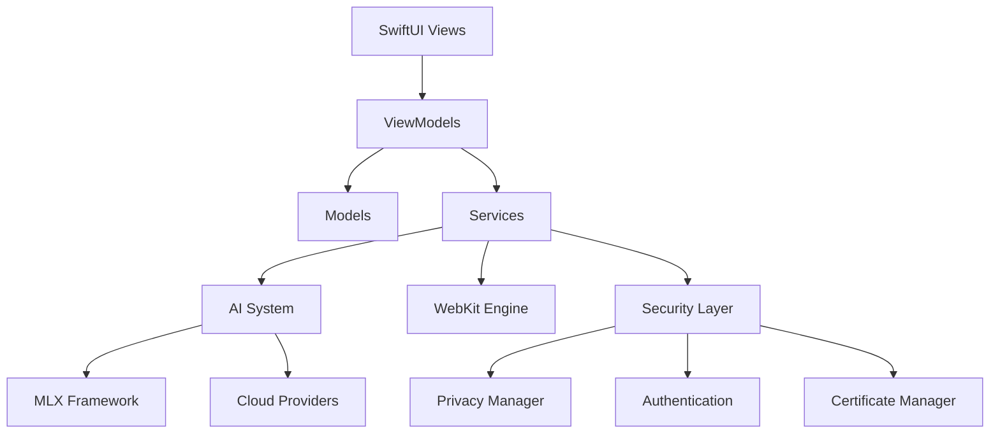

# AI Web Browser Architecture

## Overview

The AI Web Browser is a native macOS application built with SwiftUI that combines traditional web browsing capabilities with advanced AI integration. The application follows MVVM (Model-View-ViewModel) architecture patterns and emphasizes privacy-first AI processing through local inference using Apple's MLX framework.

## High-Level Architecture



## Core Architecture Principles

### 1. **Privacy-First Design**
- Local AI processing using Apple MLX framework
- Minimal data collection and transmission
- Secure credential storage using Keychain
- Comprehensive privacy controls

### 2. **Modular Service Architecture**
- Loosely coupled services for different functionalities
- Dependency injection for testability
- Clear separation of concerns

### 3. **Performance Optimization**
- Tab hibernation for memory efficiency
- Lazy loading of AI models
- Efficient resource management

### 4. **Security-Centric**
- Multiple security layers and validation
- Safe browsing integration
- Content Security Policy (CSP) enforcement
- Certificate validation and management

## Directory Structure

```
Web/
├── AI/                     # AI Integration Layer
│   ├── Agent/             # AI Agent System
│   ├── Agents/            # Agent Tools & Implementations
│   ├── Models/            # AI Data Models
│   ├── Research/          # Research & Analysis Tools
│   ├── Runners/           # MLX Model Execution
│   ├── Services/          # AI Service Providers
│   ├── Utils/             # AI Utilities
│   └── Views/             # AI UI Components
├── Models/                # Core Data Models
├── Services/              # Core Application Services
├── Utils/                 # Shared Utilities
├── ViewModels/            # Business Logic Layer
├── Views/                 # SwiftUI User Interface
│   ├── Components/        # Reusable UI Components
│   ├── MainWindow/        # Main Browser Interface
│   ├── Settings/          # Configuration Screens
│   └── ...               # Feature-specific Views
└── Resources/             # Static Assets
```

## Core Components

### 1. **AI System Architecture**

#### AI Agent Framework
```swift
// Core agent system with tool registry
AgentScript.js          // JavaScript execution environment
AgentAuditLog.swift     // Action logging and monitoring
AgentPermissionManager  // Security and permission control
PageAgent.swift         // Web page interaction agent
SmartLocator.swift      // Intelligent element location
ToolRegistry.swift      // Available tools management
```

#### AI Service Providers
- **LocalMLXProvider**: On-device inference using Apple MLX
- **OpenAIProvider**: OpenAI API integration
- **AnthropicProvider**: Claude API integration  
- **GeminiProvider**: Google Gemini API integration
- **GemmaService**: Local Gemma model support

#### MLX Integration
```swift
MLXRunner.swift           // Core MLX model execution
SimplifiedMLXRunner.swift // Streamlined inference
MLXWrapper.swift          // MLX framework wrapper
MLXModelService.swift     // Model management
```

### 2. **Web Engine Layer**

#### WebKit Integration
```swift
WebView.swift            // SwiftUI WebKit wrapper
SimpleWebView.swift      // Lightweight web component
WebContentView.swift     // Content rendering
WebKitManager.swift      // WebKit lifecycle management
WebKitSecurityValidator  // Security validation
```

#### Tab Management
```swift
TabManager.swift         // Tab lifecycle and state
Tab.swift               // Individual tab model
TabHibernationManager   // Memory optimization
SharedTabComponents     // Reusable tab UI
```

### 3. **Security Architecture**

#### Multi-Layer Security
```swift
SecurityMonitor.swift           // Core security monitoring
SecurityMonitor+Authentication  // Auth-specific security
SafeBrowsingManager.swift      // Malicious site protection
CertificateManager.swift       // SSL/TLS certificate handling
CSPManager.swift               // Content Security Policy
MixedContentManager.swift      // Mixed content protection
```

#### Privacy & Authentication
```swift
PrivacyManager.swift       // Privacy controls
AuthStateManager.swift     // Authentication state
PasswordManager.swift      // Secure password storage
SecureKeyStorage.swift     // Keychain integration
TokenManager.swift         // API token management
```

### 4. **Service Layer**

#### Core Services
```swift
BookmarkService.swift         // Bookmark management
HistoryService.swift          // Browsing history
DownloadManager.swift         // File downloads
AutofillService.swift         // Form autofill
AdBlockService.swift          // Ad blocking
```

#### System Integration
```swift
ApplicationStateObserver.swift  // App lifecycle
MemoryMonitor.swift            // Resource monitoring
NetworkConnectivityMonitor     // Network status
UpdateService.swift            // App updates
```

## Data Flow Architecture

### 1. **User Interaction Flow**
```
User Input → SwiftUI View → ViewModel → Service Layer → Model Update → UI Refresh
```

### 2. **AI Processing Flow**
```
Web Content → AI Agent → Tool Selection → Local/Cloud Processing → Result → UI Display
```

### 3. **Security Validation Flow**
```
Request → Security Monitor → Certificate Validation → CSP Check → Safe Browsing → Allow/Block
```

## AI Integration Details

### Local AI Processing
- **Framework**: Apple MLX for Apple Silicon optimization
- **Models**: Gemma and compatible language models
- **Privacy**: All processing happens on-device
- **Performance**: Hardware-accelerated inference

### Cloud AI Integration
- **BYOK (Bring Your Own Key)** approach
- Support for multiple providers simultaneously
- Fallback mechanisms for reliability
- Usage tracking and budget management

### AI Agent System
- **Tool-based architecture** for extensibility
- **Permission system** for security
- **Audit logging** for transparency
- **JavaScript execution** for web interaction

## Performance Optimizations

### Memory Management
- **Tab Hibernation**: Inactive tabs release memory
- **Lazy Loading**: AI models loaded on demand
- **Resource Monitoring**: Proactive memory management
- **Efficient Caching**: Smart content caching

### Rendering Performance
- **Native WebKit**: Hardware-accelerated rendering
- **SwiftUI Optimization**: Efficient view updates
- **Background Processing**: Non-blocking operations

## Security Model

### Defense in Depth
1. **Network Layer**: Safe browsing, certificate validation
2. **Content Layer**: CSP enforcement, mixed content protection
3. **Application Layer**: Secure storage, authentication
4. **AI Layer**: Permission management, audit logging

### Privacy Protection
- **Local Processing**: AI inference on-device when possible
- **Minimal Data Collection**: Only essential data stored
- **Secure Storage**: Keychain for sensitive data
- **User Control**: Granular privacy settings

## Development Patterns

### MVVM Implementation
- **Models**: Pure data structures
- **Views**: SwiftUI declarative UI
- **ViewModels**: Business logic and state management
- **Services**: External integrations and data persistence

### Dependency Management
- **Service Injection**: Testable architecture
- **Protocol-Oriented**: Interface-based design
- **Modular Structure**: Independent components

### Error Handling
- **Comprehensive Logging**: Detailed error tracking
- **Graceful Degradation**: Fallback mechanisms
- **User Feedback**: Clear error communication

## Future Architecture Considerations

### Scalability
- **Plugin Architecture**: Extensible AI tools
- **Microservices**: Service decomposition
- **Cloud Integration**: Enhanced cloud capabilities

### Performance
- **Streaming**: Real-time AI processing
- **Caching**: Intelligent content caching
- **Optimization**: Continuous performance improvements

### Security
- **Zero Trust**: Enhanced security model
- **Encryption**: End-to-end data protection
- **Compliance**: Privacy regulation adherence

## Technology Stack

### Core Technologies
- **Swift 6**: Modern Swift with strict concurrency
- **SwiftUI**: Declarative user interface
- **Combine**: Reactive programming
- **WebKit**: Web rendering engine
- **Core Data**: Local data persistence

### AI Technologies
- **Apple MLX**: Local machine learning
- **MLX Swift**: Swift bindings for MLX
- **OpenAI API**: Cloud AI integration
- **Anthropic Claude**: Advanced AI capabilities
- **Google Gemini**: Multi-modal AI

### Security Technologies
- **Keychain Services**: Secure credential storage
- **Network Security**: TLS/SSL validation
- **App Transport Security**: Network protection
- **Code Signing**: Application integrity

This architecture provides a solid foundation for a privacy-focused, AI-enhanced web browser that can scale and evolve with changing requirements while maintaining security and performance standards.