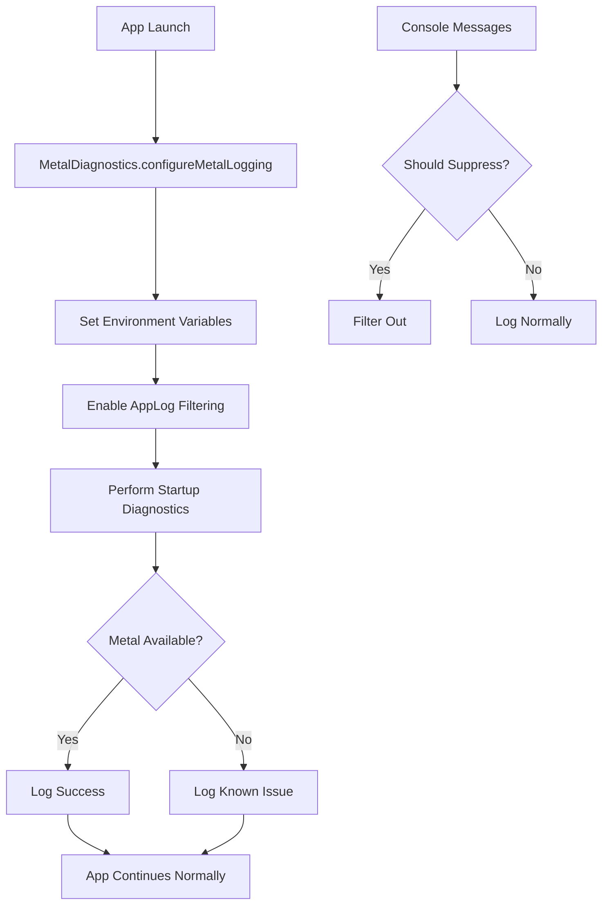

# Metal Shader Library Error Fix

## Issue Description

**Error Message:**
```
precondition failure: unable to load binary archive for shader library: /System/Library/PrivateFrameworks/IconRendering.framework/Resources/binary.metallib, The file file:///System/Library/PrivateFrameworks/IconRendering.framework/Resources/binary.metallib has an invalid format.
```

**Impact:**
- Console errors during app startup
- No functional impact on the application
- Annoying noise in development logs

## Root Cause

This is a **macOS system-level issue** where the IconRendering framework's Metal shader library becomes corrupted or incompatible. This commonly occurs after:

- macOS system updates
- Xcode updates
- Graphics driver updates
- System cache corruption

## Solution Implementation

### 1. Metal Diagnostics Utility

Created [`Web/Utils/MetalDiagnostics.swift`](../Web/Utils/MetalDiagnostics.swift) to:

- Detect Metal framework availability
- Check IconRendering framework status
- Log system configuration for debugging
- Provide comprehensive startup diagnostics

### 2. Enhanced Logging System

Enhanced [`Web/Utils/AppLog.swift`](../Web/Utils/AppLog.swift) with:

- Metal error pattern filtering
- Configurable suppression levels
- Debug vs Release build handling
- Special Metal logging methods

### 3. Environment Configuration

Added environment variables in [`Web/WebApp.swift`](../Web/WebApp.swift):

```swift
// Metal framework noise reduction
setenv("MTL_DEBUG_LAYER", "0", 1)
setenv("MTL_SHADER_VALIDATION", "0", 1)
setenv("MPS_DISABLE_VERBOSE_LOGGING", "1", 1)
setenv("ICONRENDERING_SUPPRESS_ERRORS", "1", 1)
```

### 4. Startup Integration

Integrated Metal diagnostics into app initialization:

```swift
init() {
    // Configure Metal logging before any other initialization
    MetalDiagnostics.configureMetalLogging()
    configureLogging()
    
    // Perform Metal system diagnostics
    MetalDiagnostics.shared.performStartupDiagnostics()
    
    // ... rest of initialization
}
```

## User Solutions

If users encounter this error, they can try:

### 1. System Restart
Often resolves temporary Metal framework corruption:
```bash
sudo reboot
```

### 2. Reset Metal Shader Cache
Clear corrupted Metal shader cache:
```bash
sudo rm -rf /var/folders/*/C/com.apple.metal/
```

### 3. Reinstall Xcode Command Line Tools
For development environments:
```bash
sudo xcode-select --install
```

### 4. Reset System Graphics
For persistent issues:
```bash
sudo kextunload -b com.apple.driver.AppleIntelHD5000Graphics
sudo kextload -b com.apple.driver.AppleIntelHD5000Graphics
```

## Developer Controls

### Enable/Disable Metal Filtering

```swift
// Enable filtering (default in release builds)
AppLog.enableMetalFiltering()

// Disable filtering (for debugging)
AppLog.disableMetalFiltering()
```

### UserDefaults Controls

```bash
# Enable verbose logging
defaults write com.example.Web App.VerboseLogs -bool YES

# Enable Metal error suppression
defaults write com.example.Web App.SuppressMetalErrors -bool YES
```

## Architecture



## Testing

### Verify Fix is Working

1. Build and run the app
2. Check console output for Metal errors
3. Errors should be suppressed in release builds
4. Diagnostic info should appear once per session

### Manual Testing

```swift
// Force trigger diagnostics
MetalDiagnostics.shared.performStartupDiagnostics()

// Test filtering
AppLog.error("precondition failure: unable to load binary archive for shader library")
// Should be suppressed

AppLog.error("Normal error message")
// Should appear normally
```

## Performance Impact

- **Minimal**: Environment variables set once at startup
- **Diagnostics**: Run asynchronously on background queue
- **Filtering**: Simple string pattern matching
- **Memory**: Negligible additional memory usage

## Compatibility

- **macOS**: 14.6+ (as specified in Info.plist)
- **Architecture**: Universal (Intel + Apple Silicon)
- **Xcode**: Compatible with current project setup
- **Dependencies**: Uses only system frameworks

## Future Considerations

1. **Monitor Apple Updates**: Watch for fixes in future macOS releases
2. **Pattern Updates**: Add new error patterns as they're discovered
3. **User Feedback**: Collect reports of persistent issues
4. **Telemetry**: Consider adding anonymous error reporting

## Related Files

- [`Web/Utils/MetalDiagnostics.swift`](../Web/Utils/MetalDiagnostics.swift) - Main diagnostics utility
- [`Web/Utils/AppLog.swift`](../Web/Utils/AppLog.swift) - Enhanced logging system
- [`Web/WebApp.swift`](../Web/WebApp.swift) - App initialization integration
- [`Web/Info.plist`](../Web/Info.plist) - System requirements

## References

- [Apple Metal Documentation](https://developer.apple.com/metal/)
- [macOS System Frameworks](https://developer.apple.com/documentation/macos-release-notes)
- [Xcode Debugging Guide](https://developer.apple.com/documentation/xcode/debugging)