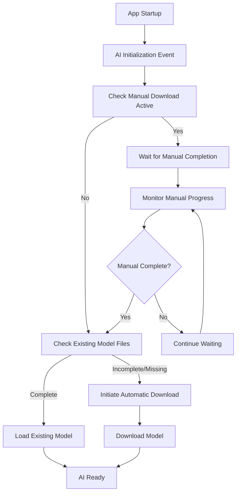

# Product Requirements Document: Intelligent AI Initialization

## Overview

This PRD outlines the enhanced AI initialization strategy for the Web browser that eliminates conflicts between automatic model downloads and manual download processes while maintaining startup AI initialization.

## Problem Statement

### Current Issues
- **Race Conditions**: Automatic AI initialization during app startup conflicts with manual model downloads
- **Cache Conflicts**: App attempts to clean/validate cache while manual scripts are writing files
- **Download Interference**: Automatic downloads can corrupt or interfere with ongoing manual downloads
- **User Frustration**: Manual download scripts fail due to app interference

### Root Cause
The application immediately triggers AI model download/validation during startup without checking for:
- Existing valid model files
- Active manual download processes
- File system locks or ongoing operations

## Solution: Smart Startup AI Initialization

### Core Principle
**AI initialization remains a startup event**, but becomes **intelligent about existing state** and **respectful of ongoing processes**.

### Key Features

#### 1. Intelligent Model Detection
- **Quick File Check**: Fast detection of existing complete model files
- **Validation Caching**: Remember successful validations to avoid redundant checks
- **State Persistence**: Track model download completion across app sessions

#### 2. Manual Download Coordination
- **Process Detection**: Identify active manual download scripts or curl processes
- **Graceful Waiting**: Pause automatic initialization when manual downloads are active
- **Completion Monitoring**: Wait for manual downloads to finish before proceeding
- **Timeout Handling**: Fallback to automatic download if manual process stalls

#### 3. Conflict Prevention
- **File Lock Awareness**: Detect and respect file system locks
- **Cache Coordination**: Avoid cache cleanup during active downloads
- **Process Isolation**: Ensure manual and automatic processes don't interfere

## Technical Implementation

### Smart Startup Flow



### Key Components

#### 1. MLXCacheManager Enhancements
- `isManualDownloadActive()`: Detects running manual download processes
- `hasCompleteModelFiles()`: Quick check for existing complete models
- Enhanced error handling for locked files and permission issues

#### 2. MLXModelService Smart Initialization
- `performSmartStartupInitialization()`: New intelligent startup method
- `waitForManualDownloadCompletion()`: Monitors and waits for manual downloads
- Graceful fallback to automatic download when needed

#### 3. Process Coordination
- **Detection Methods**: Process scanning, file lock detection, curl monitoring
- **Wait Strategy**: Intelligent waiting with timeout and progress updates
- **Fallback Handling**: Automatic download if manual process fails or times out

## User Experience

### Startup Scenarios

#### Scenario 1: Fresh Installation
1. App starts → No model found → Automatic download begins
2. User sees normal download progress
3. AI becomes available after download completes

#### Scenario 2: Manual Download in Progress
1. User runs manual download script
2. App starts → Detects manual download → Waits gracefully
3. Manual download completes → App loads existing model
4. AI becomes available immediately

#### Scenario 3: Model Already Downloaded
1. App starts → Detects existing valid model → Loads immediately
2. No download needed → AI available instantly
3. Fast startup experience

#### Scenario 4: Corrupted Cache
1. App starts → Detects corrupted files → Cleans cache
2. Proceeds with automatic download
3. Enhanced error handling prevents conflicts

### User Benefits

#### 1. Reliability
- **No Conflicts**: Manual downloads always succeed
- **Predictable Behavior**: Consistent startup experience
- **Error Recovery**: Robust handling of edge cases

#### 2. Performance
- **Fast Startup**: Skip downloads when model exists
- **Efficient Detection**: Quick file checks without full validation
- **Smart Caching**: Remember successful validations

#### 3. Flexibility
- **Manual Control**: Users can run manual downloads without interference
- **Automatic Fallback**: App handles downloads when manual isn't used
- **Recovery Options**: Multiple paths to working AI

## Implementation Details

### Configuration Options
- **Manual Download Timeout**: Maximum wait time for manual downloads (default: 5 minutes)
- **Check Interval**: How often to check manual download progress (default: 5 seconds)
- **Validation Caching**: Remember successful model validations (default: enabled)

### Error Handling
- **Graceful Degradation**: Continue operation even with partial failures
- **Clear Messaging**: Inform users about wait states and progress
- **Fallback Mechanisms**: Multiple recovery paths for different failure modes

### Logging and Monitoring
- **Detailed Logging**: Track all initialization steps and decisions
- **Progress Updates**: Real-time feedback on wait states and downloads
- **Error Reporting**: Clear error messages with actionable guidance
- **Debug Messages**: Enhanced manual download script with comprehensive location debug messages for troubleshooting

## Success Criteria

### Primary Goals
1. **✅ Zero Conflicts**: Manual downloads never fail due to app interference
2. **✅ Startup AI**: AI initialization remains a startup event
3. **✅ Smart Detection**: App recognizes existing downloads and avoids redundant work
4. **✅ User Control**: Users can choose manual or automatic download methods

### Performance Targets
- **Fast Recognition**: Existing model detection < 1 second
- **Efficient Waiting**: Manual download monitoring with minimal overhead
- **Quick Loading**: Existing model loading < 5 seconds
- **Timeout Handling**: Graceful fallback within 5 minutes

### User Experience Goals
- **Transparent Process**: Clear feedback on what the app is doing
- **No Surprises**: Predictable behavior in all scenarios
- **Recovery Options**: Clear guidance when issues occur
- **Documentation**: Comprehensive guides for all use cases

## Testing Strategy

### Test Scenarios
1. **Fresh Install**: Verify automatic download works correctly
2. **Manual Download Active**: Verify app waits and loads manual files
3. **Existing Model**: Verify fast loading of pre-downloaded models
4. **Corrupted Cache**: Verify cleanup and recovery processes
5. **Network Issues**: Verify graceful handling of download failures
6. **Concurrent Access**: Verify no conflicts between processes

### Validation Criteria
- No file corruption during manual downloads
- Successful model loading in all scenarios
- Clear error messages and recovery guidance
- Performance within target ranges

## Future Enhancements

### Phase 2 Features
- **Parallel Downloads**: Download model components in parallel
- **Delta Updates**: Only download changed model components
- **Background Validation**: Periodic model integrity checks
- **User Preferences**: Configurable initialization behavior

### Alternative Model Conversion
- **Standalone Converter**: `scripts/convert_gemma.sh` for GGUF to MLX conversion
- **Custom Model Support**: Convert user-provided GGUF models to MLX format
- **Advanced Configuration**: Customizable quantization and output settings

### Advanced Coordination
- **Inter-Process Communication**: Direct coordination between app and scripts
- **Shared State**: Common state file for coordination
- **Progress Sharing**: Real-time progress updates between processes

## Alternative Model Conversion

### Standalone GGUF to MLX Converter

The project includes `scripts/convert_gemma.sh` as a standalone utility for advanced users who want to convert GGUF models to MLX format manually.

#### Features
- **GGUF to MLX Conversion**: Converts Hugging Face GGUF models to Apple Silicon optimized MLX format
- **4-bit Quantization**: Automatic quantization for optimal performance and memory usage
- **Dependency Checking**: Validates Python 3 and mlx-lm package availability
- **Model Verification**: Comprehensive validation of converted model files
- **Documentation Generation**: Creates detailed README for converted models

#### Usage
```bash
# Install dependencies
pip install mlx-lm

# Run conversion
./scripts/convert_gemma.sh
```

#### Configuration
- **Source Model**: `bartowski/gemma-2-2b-it-gguf` (Hugging Face GGUF format)
- **Output Location**: `~/Library/Caches/Web/AI/Models/gemma-2b-mlx-int4`
- **Quantization**: 4-bit integer quantization
- **Verification**: Automatic model file validation and size reporting

#### Integration
- **Cache Compatibility**: Outputs to standard Web browser cache directory
- **Automatic Detection**: Converted models are automatically detected by the application
- **Performance Optimization**: MLX format provides optimal Apple Silicon performance

## Documentation Updates

### User Documentation
- **README.md**: Updated installation guide with smart initialization info and standalone converter documentation
- **Troubleshooting Guide**: Enhanced with coordination scenarios
- **Manual Download Guide**: Clear instructions for manual download timing
- **Converter Guide**: Documentation for standalone GGUF to MLX conversion

### Technical Documentation
- **Architecture Guide**: Smart initialization flow documentation
- **API Documentation**: New methods and configuration options
- **Error Handling Guide**: Comprehensive error scenarios and solutions

## Conclusion

The intelligent AI initialization strategy maintains the desired startup AI initialization while eliminating conflicts with manual downloads. This provides users with a reliable, predictable experience that respects their choice of download method while ensuring AI features are always available when needed.