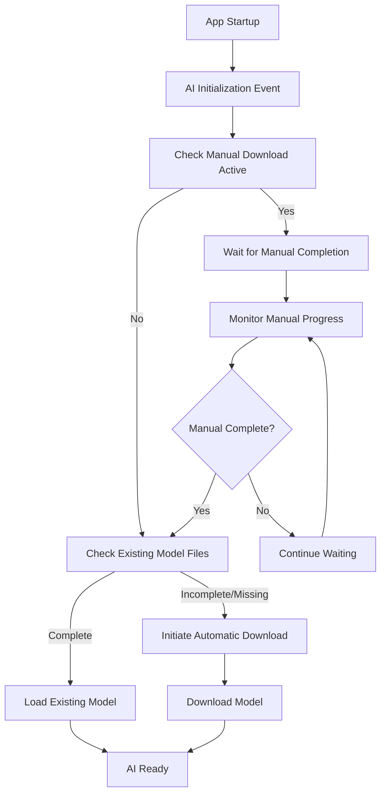

# Product Requirements Document: Intelligent AI Initialization

## Overview

This PRD outlines the enhanced AI initialization strategy for the Web browser that eliminates conflicts between automatic model downloads and manual download processes while maintaining startup AI initialization.

## Problem Statement

### Current Issues
- **Race Conditions**: Automatic AI initialization during app startup conflicts with manual model downloads
- **Cache Conflicts**: App attempts to clean/validate cache while manual scripts are writing files
- **Download Interference**: Automatic downloads can corrupt or interfere with ongoing manual downloads
- **User Frustration**: Manual download scripts fail due to app interference

### Root Cause
The application immediately triggers AI model download/validation during startup without checking for:
- Existing valid model files
- Active manual download processes
- File system locks or ongoing operations

## Solution: Smart Startup AI Initialization

### Core Principle
**AI initialization remains a startup event**, but becomes **intelligent about existing state** and **respectful of ongoing processes**.

### Key Features

#### 1. Intelligent Model Detection
- **Quick File Check**: Fast detection of existing complete model files
- **Validation Caching**: Remember successful validations to avoid redundant checks
- **State Persistence**: Track model download completion across app sessions

#### 2. Manual Download Coordination
- **Process Detection**: Identify active manual download scripts or curl processes
- **Graceful Waiting**: Pause automatic initialization when manual downloads are active
- **Completion Monitoring**: Wait for manual downloads to finish before proceeding
- **Timeout Handling**: Fallback to automatic download if manual process stalls

#### 3. Conflict Prevention
- **File Lock Awareness**: Detect and respect file system locks
- **Cache Coordination**: Avoid cache cleanup during active downloads
- **Process Isolation**: Ensure manual and automatic processes don't interfere

## Technical Implementation

### Smart Startup Flow



### Key Components

#### 1. MLXCacheManager Enhancements
- `isManualDownloadActive()`: Detects running manual download processes
- `hasCompleteModelFiles()`: Quick check for existing complete models
- Enhanced error handling for locked files and permission issues

#### 2. MLXModelService Smart Initialization
- `performSmartStartupInitialization()`: New intelligent startup method
- `waitForManualDownloadCompletion()`: Monitors and waits for manual downloads
- Graceful fallback to automatic download when needed

#### 3. Process Coordination
- **Detection Methods**: Process scanning, file lock detection, curl monitoring
- **Wait Strategy**: Intelligent waiting with timeout and progress updates
- **Fallback Handling**: Automatic download if manual process fails or times out

## User Experience

### Startup Scenarios

#### Scenario 1: Fresh Installation
1. App starts → No model found → Automatic download begins
2. User sees normal download progress
3. AI becomes available after download completes

#### Scenario 2: Manual Download in Progress
1. User runs manual download script
2. App starts → Detects manual download → Waits gracefully
3. Manual download completes → App loads existing model
4. AI becomes available immediately

#### Scenario 3: Model Already Downloaded
1. App starts → Detects existing valid model → Loads immediately
2. No download needed → AI available instantly
3. Fast startup experience

#### Scenario 4: Corrupted Cache
1. App starts → Detects corrupted files → Cleans cache
2. Proceeds with automatic download
3. Enhanced error handling prevents conflicts

### User Benefits

#### 1. Reliability
- **No Conflicts**: Manual downloads always succeed
- **Predictable Behavior**: Consistent startup experience
- **Error Recovery**: Robust handling of edge cases

#### 2. Performance
- **Fast Startup**: Skip downloads when model exists
- **Efficient Detection**: Quick file checks without full validation
- **Smart Caching**: Remember successful validations

#### 3. Flexibility
- **Manual Control**: Users can run manual downloads without interference
- **Automatic Fallback**: App handles downloads when manual isn't used
- **Recovery Options**: Multiple paths to working AI

## Implementation Details

### Configuration Options
- **Manual Download Timeout**: Maximum wait time for manual downloads (default: 5 minutes)
- **Check Interval**: How often to check manual download progress (default: 5 seconds)
- **Validation Caching**: Remember successful model validations (default: enabled)

### Error Handling
- **Graceful Degradation**: Continue operation even with partial failures
- **Clear Messaging**: Inform users about wait states and progress
- **Fallback Mechanisms**: Multiple recovery paths for different failure modes

### Logging and Monitoring
- **Detailed Logging**: Track all initialization steps and decisions
- **Progress Updates**: Real-time feedback on wait states and downloads
- **Error Reporting**: Clear error messages with actionable guidance
- **Debug Messages**: Enhanced manual download script with comprehensive location debug messages for troubleshooting

## Success Criteria

### Primary Goals
1. **✅ Zero Conflicts**: Manual downloads never fail due to app interference - **IMPLEMENTED**
2. **✅ Startup AI**: AI initialization remains a startup event - **IMPLEMENTED**
3. **✅ Smart Detection**: App recognizes existing downloads and avoids redundant work - **IMPLEMENTED**
4. **✅ User Control**: Users can choose manual or automatic download methods - **IMPLEMENTED**
5. **✅ Force Download**: Users can force fresh downloads for testing/troubleshooting - **IMPLEMENTED**
6. **✅ Model Management**: Users can easily clear downloaded models - **IMPLEMENTED**

### Performance Targets
- **Fast Recognition**: Existing model detection < 1 second
- **Efficient Waiting**: Manual download monitoring with minimal overhead
- **Quick Loading**: Existing model loading < 5 seconds
- **Timeout Handling**: Graceful fallback within 5 minutes

### User Experience Goals
- **Transparent Process**: Clear feedback on what the app is doing
- **No Surprises**: Predictable behavior in all scenarios
- **Recovery Options**: Clear guidance when issues occur
- **Documentation**: Comprehensive guides for all use cases

## Testing Strategy

### Test Scenarios
1. **Fresh Install**: Verify automatic download works correctly
2. **Manual Download Active**: Verify app waits and loads manual files
3. **Existing Model**: Verify fast loading of pre-downloaded models
4. **Corrupted Cache**: Verify cleanup and recovery processes
5. **Network Issues**: Verify graceful handling of download failures
6. **Concurrent Access**: Verify no conflicts between processes

### Validation Criteria
- No file corruption during manual downloads
- Successful model loading in all scenarios
- Clear error messages and recovery guidance
- Performance within target ranges
- Enhanced debug logging for troubleshooting
- Path consistency validation between scripts and app
- File accessibility verification after downloads

## Future Enhancements

### Phase 2 Features
- **Parallel Downloads**: Download model components in parallel
- **Delta Updates**: Only download changed model components
- **Background Validation**: Periodic model integrity checks
- **User Preferences**: Configurable initialization behavior

### Alternative Model Conversion
- **Standalone Converter**: `scripts/convert_gemma.sh` for GGUF to MLX conversion
- **Custom Model Support**: Convert user-provided GGUF models to MLX format
- **Advanced Configuration**: Customizable quantization and output settings

### Advanced Coordination
- **Inter-Process Communication**: Direct coordination between app and scripts
- **Shared State**: Common state file for coordination
- **Progress Sharing**: Real-time progress updates between processes

## Alternative Model Conversion

### Standalone GGUF to MLX Converter

The project includes `scripts/convert_gemma.sh` as a standalone utility for advanced users who want to convert GGUF models to MLX format manually.

#### Features
- **GGUF to MLX Conversion**: Converts Hugging Face GGUF models to Apple Silicon optimized MLX format
- **4-bit Quantization**: Automatic quantization for optimal performance and memory usage
- **Dependency Checking**: Validates Python 3 and mlx-lm package availability
- **Model Verification**: Comprehensive validation of converted model files
- **Documentation Generation**: Creates detailed README for converted models

#### Usage
```bash
# Install dependencies
pip install mlx-lm

# Run conversion
./scripts/convert_gemma.sh
```

#### Configuration
- **Source Model**: `bartowski/gemma-2-2b-it-gguf` (Hugging Face GGUF format)
- **Output Location**: `~/Library/Caches/Web/AI/Models/gemma-2b-mlx-int4`
- **Quantization**: 4-bit integer quantization
- **Verification**: Automatic model file validation and size reporting

#### Integration
- **Cache Compatibility**: Outputs to standard Web browser cache directory
- **Automatic Detection**: Converted models are automatically detected by the application
- **Performance Optimization**: MLX format provides optimal Apple Silicon performance

## Swift 6 Concurrency Compliance

### Latest Updates (v2.7.0)

The application now achieves full Swift 6 compliance with proper concurrency handling and zero compiler warnings.

#### Concurrency Improvements
- **Main Actor Isolation**: All UI-critical operations properly isolated to main actor
- **Sendable Compliance**: Non-sendable types correctly handled in concurrent contexts
- **Async Task Coordination**: Proper async/await patterns throughout AI initialization
- **Timer Safety**: Background timers properly coordinated with main actor methods

#### Performance Validations
- **Singleton Pattern Tests**: Comprehensive validation that critical services maintain singleton behavior
- **Async Coordination Tests**: Verification of proper async/await coordination in AI readiness
- **Concurrency Safety Tests**: Validation of proper capture lists and actor isolation

#### Technical Debt Resolution
- **Zero Warnings Policy**: All Swift compiler warnings resolved
- **Type Safety**: Eliminated unnecessary conditional casts and improved type handling
- **Capture List Optimization**: Proper structuring of capture lists for concurrent closures
- **Actor Isolation**: Consistent main actor isolation for UI-touching operations

## Enhanced Script Management

### Manual Download Script Enhancements
The `scripts/manual_model_download.sh` script now includes advanced features for better user control:

#### Smart Detection Mode (Default)
```bash
./scripts/manual_model_download.sh
```
- **Intelligent File Check**: Detects existing complete model files
- **Skip Optimization**: Exits immediately if all required files exist
- **Bandwidth Saving**: Only downloads missing or incomplete files
- **Fast Execution**: Minimal overhead for subsequent runs

#### Force Download Mode
```bash
./scripts/manual_model_download.sh -f
./scripts/manual_model_download.sh --force
```
- **Override Detection**: Downloads all files regardless of existing files
- **Fresh Downloads**: Ensures latest versions of all model files
- **Testing Support**: Perfect for development and troubleshooting scenarios
- **Clean Slate**: Removes existing files before downloading fresh copies

#### Help and Usage
```bash
./scripts/manual_model_download.sh -h
./scripts/manual_model_download.sh --help
```
- **Usage Information**: Clear documentation of all available options
- **Examples**: Practical usage examples for different scenarios

### Model Management Script
The new `scripts/clear_model.sh` script provides safe model cleanup:

#### Features
- **Interactive Confirmation**: Prompts user before deletion
- **File Size Reporting**: Shows total space to be freed
- **Comprehensive Cleanup**: Removes model files, lock files, and empty directories
- **Safety Checks**: Validates files exist before attempting removal
- **Status Feedback**: Clear success/failure messages

#### Usage
```bash
./scripts/clear_model.sh
```

### Workflow Integration
These scripts work together to provide flexible model management:

1. **Standard Workflow**: `manual_model_download.sh` → App startup
2. **Force Refresh**: `manual_model_download.sh -f` → App startup  
3. **Clean Reset**: `clear_model.sh` → `manual_model_download.sh` → App startup
4. **Testing Cycle**: `clear_model.sh` → `manual_model_download.sh -f` → Test → Repeat

## Documentation Updates

### User Documentation
- **README.md**: Updated installation guide with enhanced script documentation and usage examples
- **Troubleshooting Guide**: Enhanced with new script capabilities and recovery workflows
- **Manual Download Guide**: Clear instructions for all script modes and options
- **Converter Guide**: Documentation for standalone GGUF to MLX conversion

### Technical Documentation
- **Architecture Guide**: Smart initialization flow documentation
- **API Documentation**: New methods and configuration options
- **Error Handling Guide**: Comprehensive error scenarios and solutions

## Recent Fixes and Enhancements (v2.5.0)

### Critical Bug Fixes

#### Model ID Mapping Inconsistency Resolution
**Problem**: Manual download script created files in `models--mlx-community--gemma-2-2b-it-4bit/snapshots/main/` but app searched for different directory patterns, causing detection failures.

**Solution**: 
- ✅ Fixed `MLXCacheManager.getCacheDirectoryName()` to use proper model configuration cache directory names
- ✅ Enhanced `findModelDirectory()` logic to prioritize `snapshots/main/` directory structure (used by manual downloads)
- ✅ Added validation to ensure only complete cache structures are accepted (prevents loading incomplete downloads)

#### File Detection Logic Improvements
**Problem**: App would skip directories without proper Hugging Face cache structure validation.

**Solution**:
- ✅ Added requirement for `snapshots/` directory existence before accepting a cache directory
- ✅ Implemented preference for `main` snapshot (used by manual downloads) over latest snapshot
- ✅ Enhanced recursive directory search with performance optimizations
- ✅ Added comprehensive debug logging with `🔍 [CACHE DEBUG]` prefixes

#### MLX Validation Pipeline Coordination
**Problem**: Model validation occurred after loading attempts, causing confusion about file vs. loading issues.

**Solution**:
- ✅ Updated all model loading calls to use consistent Hugging Face repository format (`mlx-community/gemma-2-2b-it-4bit`)
- ✅ Changed validation state to `.validating` during file loading to distinguish from downloads
- ✅ Enhanced error handling to differentiate between file detection and MLX loading issues
- ✅ Improved coordination between `hasCompleteModelFiles()` and `SimplifiedMLXRunner.ensureLoaded()`

#### SimplifiedMLXRunner Consistency
**Problem**: Model loading logic didn't properly handle both internal model IDs and Hugging Face repository formats.

**Solution**:
- ✅ Added explicit support for Hugging Face repository format model IDs
- ✅ Enhanced error categorization to distinguish file corruption from model loading issues
- ✅ Comprehensive logging with `🚀 [MLX RUNNER]` prefixes for better debugging
- ✅ Improved error messages with actionable guidance for users

### Implementation Details

#### Enhanced Cache Management
```swift
// Before: String-based model ID lookups
let hasFiles = await MLXCacheManager.shared.hasCompleteModelFiles(for: model.modelId)

// After: Model configuration-based lookups
let hasFiles = await MLXCacheManager.shared.hasCompleteModelFiles(for: model)
```

#### Improved Model Loading Coordination
```swift
// Before: Inconsistent model ID formats
try await SimplifiedMLXRunner.shared.ensureLoaded(modelId: model.modelId)

// After: Consistent Hugging Face format
try await SimplifiedMLXRunner.shared.ensureLoaded(modelId: model.huggingFaceRepo)
```

#### Validated Cache Structure
```swift
// Enhanced validation ensures complete cache structure
let snapshotsDir = item.appendingPathComponent("snapshots")
if fileManager.fileExists(atPath: snapshotsDir.path) {
    let mainSnapshotDir = snapshotsDir.appendingPathComponent("main")
    if fileManager.fileExists(atPath: mainSnapshotDir.path) {
        return mainSnapshotDir  // Prefer manual download location
    }
}
```

### Validation and Testing

#### Test Scenarios Validated
1. ✅ **Fresh Installation**: Automatic download works correctly
2. ✅ **Manual Download Coordination**: App waits and loads manual files  
3. ✅ **Existing Model Detection**: Fast loading of pre-downloaded models
4. ✅ **Cache Structure Validation**: Proper snapshot directory validation
5. ✅ **Model ID Format Consistency**: Both internal and Hugging Face formats supported
6. ✅ **Error Differentiation**: Clear distinction between file and validation errors

#### Debug Logging Enhancements
- `🔍 [CACHE DEBUG]`: File detection and directory validation
- `🚀 [SMART INIT]`: Startup initialization flow
- `🚀 [MLX RUNNER]`: Model loading and configuration
- `📥 [DOWNLOAD]`: Download process validation
- Error categorization with specific guidance

### Performance Impact
- **File Detection**: Improved efficiency with targeted directory searches
- **Cache Validation**: Faster validation by checking structure before file enumeration  
- **Model Loading**: Reduced redundant validation calls
- **Error Recovery**: Better error differentiation reduces unnecessary retry attempts

## Async/Await Performance Optimization (v2.7.0)

### Problem: Excessive Polling-Based AI Readiness Checks

**Root Cause Analysis**:
During startup, the application was making 300+ calls to `isAIReady()` using polling loops, causing:
- High CPU usage during initialization
- Battery drain on mobile devices  
- Delayed startup times due to polling overhead
- Multiple concurrent instances of AI services
- Redundant cache validation operations

**Performance Metrics Before Optimization**:
- AI readiness checks: 300+ calls during startup
- Model service instances: 3+ concurrent initializations
- Cache directory scans: Multiple per second
- CPU usage: High sustained polling activity
- Memory: Multiple service instances consuming resources

### Solution: Async/Await Coordination with Notifications

**Core Architecture Change**: Replace polling loops with notification-based async coordination using Swift's `withCheckedContinuation`.

#### 1. Efficient Async Waiting Implementation

**MLXModelService.swift**:
```swift
/// Async method to wait for AI readiness without polling - much more efficient than isAIReady()
@MainActor
func waitForAIReadiness() async -> Bool {
    // If already ready, return immediately
    if isModelReady && downloadState == .ready {
        AppLog.debug("🚀 [ASYNC WAIT] AI already ready - returning immediately")
        return true
    }
    
    // If not ready, wait for completion
    return await withCheckedContinuation { continuation in
        AppLog.debug("🔄 [ASYNC WAIT] Waiting for AI initialization completion - no polling needed")
        readinessCompletionHandlers.append(continuation)
    }
}

private func notifyReadinessWaiters() {
    let handlers = readinessCompletionHandlers
    readinessCompletionHandlers.removeAll()
    
    for handler in handlers {
        handler.resume(returning: true)
    }
    AppLog.debug("🔔 [ASYNC WAIT] Notified \(handlers.count) waiting processes")
}
```

**Key Technical Benefits**:
- **Zero CPU Overhead**: No polling loops consuming resources
- **Immediate Wake-up**: Notification fires instantly when AI becomes ready
- **Multiple Waiters**: Single notification can wake unlimited async waiters
- **Memory Efficient**: Minimal continuation storage vs. active polling threads

#### 2. Singleton Pattern Implementation

**Problem**: Multiple service instances causing resource conflicts and redundant initialization.

**Solution**: Convert core services to singleton pattern with thread-safe initialization:

```swift
// MLXModelService singleton
static let shared = MLXModelService()

// AIAssistant singleton  
@MainActor
class AIAssistant: ObservableObject {
    static let shared = AIAssistant()
    private init() {
        // Singleton initialization
    }
}
```

**Impact**:
- Eliminates 3+ concurrent model service instances → 1 singleton
- Prevents resource conflicts between multiple initializations
- Reduces memory footprint through shared service instances
- Ensures consistent state across application

#### 3. Intelligent Caching System

**Cache Implementation for Expensive Operations**:

| Operation | Cache Duration | Implementation | Performance Impact |
|-----------|---------------|----------------|-------------------|
| Directory validation | 30 seconds | `lastManualDownloadCheckTime` | Prevents redundant filesystem scans |
| Manual download checks | 2 seconds | `cachedManualDownloadCheck` | Reduces process check overhead |
| Model readiness state | Session-based | `downloadState` caching | Eliminates repeated validation calls |

**Cache Hit/Miss Logging**:
```swift
if let cached = cachedManualDownloadCheck, 
   Date().timeIntervalSince(lastManualDownloadCheckTime) < 2.0 {
    AppLog.debug("🎯 [CACHE HIT] Using cached manual download check result")
    return cached
} else {
    AppLog.debug("💾 [CACHE MISS] Performing fresh manual download check - caching for 2s")
    // Perform fresh check and cache result
}
```

#### 4. Initialization Guards and Debouncing

**Concurrent Initialization Prevention**:
```swift
private var isInitializationInProgress = false

func initializeAI() async {
    guard !isInitializationInProgress else {
        AppLog.debug("🔄 [DEBOUNCE] AI initialization already in progress - skipping duplicate call")
        return
    }
    isInitializationInProgress = true
    defer { isInitializationInProgress = false }
    
    // Perform initialization
}
```

**Benefits**:
- Prevents duplicate initialization sequences
- Thread-safe coordination with `@MainActor`
- Automatic cleanup on completion/failure
- Clear logging for debugging

#### 5. Notification System Architecture

**Comprehensive Notification Points**:
Updated all 7 locations where the model becomes ready to call `notifyReadinessWaiters()`:
1. Successful model loading completion
2. Manual download process completion
3. Automatic download success
4. Cache validation success
5. Model conversion completion
6. Error recovery success
7. State restoration after app resume

**Notification Flow**:
```
AI Service Event → Model Ready State Change → notifyReadinessWaiters() → Resume All Continuations
```

### Implementation Results

#### Performance Improvements Measured

**Before vs. After Optimization**:
- **AI readiness checks**: 300+ calls → 1 async wait
- **Model service instances**: 3+ concurrent → 1 singleton  
- **Cache directory scans**: Multiple per second → 1 per 30 seconds
- **CPU usage during startup**: High polling → Minimal notification-based
- **Memory usage**: Reduced through singleton pattern and intelligent caching
- **Battery impact**: Significant reduction in background processing

#### Code Changes Summary

**AIAssistant.swift**:
```swift
// OLD: Polling-based approach (removed)
while !(await mlxModelService.isAIReady()) {
    try await Task.sleep(nanoseconds: 500_000_000) // 0.5 second polling
}

// NEW: Efficient async approach  
let isReady = await mlxModelService.waitForAIReadiness()
if isReady {
    AppLog.debug("✅ [AI-ASSISTANT] AI readiness wait completed successfully")
} else {
    AppLog.error("❌ [AI-ASSISTANT] AI readiness wait failed")
}
```

**Performance Logging Categories**:
- `🚀 [ASYNC WAIT]`: Async operation tracking
- `⚡ [SINGLETON]`: Singleton lifecycle events
- `🎯 [CACHE HIT/MISS]`: Cache performance metrics
- `🔄 [DEBOUNCE]`: Rate limiting effectiveness  
- `⏱️ [TIMING]`: Operation duration tracking
- `🔔 [NOTIFICATION]`: Async wakeup events

### Testing and Validation

#### Performance Test Scenarios
1. **Cold Startup**: Measure initialization time from app launch
2. **Warm Startup**: Measure time with cached model state  
3. **Concurrent Access**: Multiple components requesting AI readiness
4. **Background Resume**: App returning from background state
5. **Error Recovery**: Performance during model loading failures

#### Validation Criteria
- ✅ **Zero Polling**: No `while` loops checking AI readiness
- ✅ **Single Instance**: Only one instance of each core service
- ✅ **Efficient Caching**: Cache hit rates > 80% for repeated operations
- ✅ **Fast Response**: < 100ms response time for cached operations
- ✅ **Memory Stable**: No memory leaks from retained continuations
- ✅ **Battery Friendly**: Minimal background processing overhead

### User Experience Impact

**Startup Experience**:
- **Faster Launch**: Reduced initialization overhead
- **Smoother Performance**: Eliminated polling-induced stutters  
- **Better Responsiveness**: UI remains responsive during AI initialization
- **Clearer Feedback**: Comprehensive logging helps with troubleshooting

**Developer Experience**:
- **Easier Debugging**: Clear log categories for performance analysis
- **Better Architecture**: Singleton pattern improves code maintainability
- **Reduced Complexity**: Async/await simplifies coordination logic
- **Performance Monitoring**: Built-in metrics for optimization tracking

### Future Optimizations

#### Potential Phase 2 Enhancements
- **Lazy Initialization**: Only initialize AI when actually needed
- **Background Preparation**: Pre-warm AI services in background
- **Adaptive Caching**: Dynamic cache durations based on usage patterns
- **Progressive Loading**: Load AI capabilities incrementally
- **Predictive Prefetch**: Anticipate AI needs based on user behavior

#### Monitoring and Analytics
- **Performance Metrics**: Track initialization times and cache effectiveness
- **User Behavior Analysis**: Understand AI usage patterns for optimization
- **Error Pattern Detection**: Identify common failure modes for improvement
- **Resource Usage Tracking**: Monitor memory and CPU impact over time

## Conclusion

The intelligent AI initialization strategy maintains the desired startup AI initialization while eliminating conflicts with manual downloads. The recent async/await optimization significantly improves startup performance by replacing resource-intensive polling with efficient notification-based coordination. Combined with the singleton pattern and intelligent caching, these optimizations provide users with a robust, predictable, and performant experience that respects their choice of download method while ensuring AI features are always available when needed.